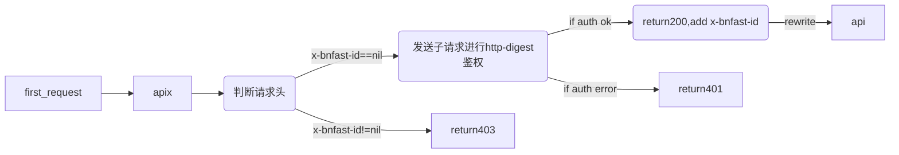
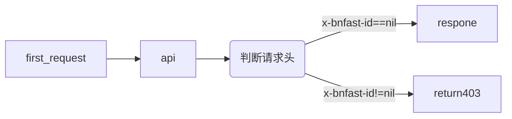

## GATEWAY 
#### test by docker
```
docker run -d --name openresty  -v /openresty/conf.d:/etc/nginx/conf.d -v /openresty/nginx.conf:/usr/local/openresty/nginx/conf/nginx.conf  -e TZ=Asia/Shanghai -p 80:80 openresty/openresty:centos
```
#### request rules 

---

#### other 
目前在测试环境tls 和 static file 都还是在 jump 服务器的nginx直接处理 ，等正式部署，可以考虑增加tls 和static的在网关配置中，配置同普通nginx配置。